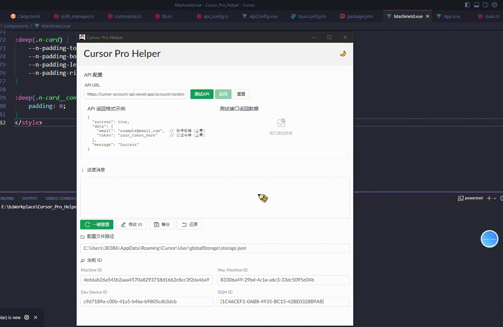

# Cursor Pro Helper

<div align="center">

[](https://github.com/Elawen-Carl/Cursor_Pro_Helper/actions/workflows/ci.yml)
[](https://github.com/Elawen-Carl/Cursor_Pro_Helper/releases)
[](https://github.com/Elawen-Carl/Cursor_Pro_Helper/releases)
[](https://github.com/Elawen-Carl/Cursor_Pro_Helper/stargazers)
[](https://github.com/Elawen-Carl/Cursor_Pro_Helper/network/members)
[](https://github.com/Elawen-Carl/Cursor_Pro_Helper/issues)
[](https://creativecommons.org/licenses/by-nc/4.0/)

<p align="center">
  
</p>

**简体中文** | [English](./README_EN.md)

一个强大而优雅的 Cursor 辅助增强工具，基于 Rust + Tauri + Vue3 开发。

[立即下载](https://github.com/Elawen-Carl/Cursor_Pro_Helper/releases) · 
[问题反馈](https://github.com/Elawen-Carl/Cursor_Pro_Helper/issues) · 
[功能建议](https://github.com/Elawen-Carl/Cursor_Pro_Helper/issues)

</div>


**快速解决：**
1. 关闭 Cursor
2. 执行一键重置
3. 重新登录

**备选方案：**
1. 更换账号
2. 清理浏览器缓存
3. 检查网络连接

### ⚡ 一键重置演示
<div align="center">
  
</div>

## ✨ 核心特性

### 🚀 高效重置
- 一键重置机器ID
- 智能配置管理
- 快速恢复运行

### 🎨 现代界面
- 简洁优雅的设计
- 亮暗主题无缝切换
- 流畅的动画效果

### 💻 全平台支持
- Windows 系统优化
- macOS 原生适配
- Linux 完整支持

### 📊 实时反馈
- 详细的进度提示
- 清晰的状态展示
- 智能的错误处理

## 📦 安装

从 [Release](https://github.com/Elawen-Carl/Cursor_Pro_Helper/releases) 页面下载最新版本安装包：

- Windows: `.msi` 安装包
- macOS: `.dmg` 安装包
- Linux: `.AppImage` 或 `.deb` 包

## 📥 安装指南

### Windows 安装
1. 从 [Release](https://github.com/Elawen-Carl/Cursor_Pro_Helper/releases) 页面下载最新的 `.msi` 安装包
2. 双击安装包，按照安装向导进行安装
3. 安装完成后，在开始菜单找到 "Cursor Pro Helper" 启动

### macOS 安装
1. 下载最新的 `.dmg` 安装包
2. 打开 DMG 文件，将应用拖入 Applications 文件夹
3. 首次运行时，按住 Control 键点击应用图标，选择"打开"

### Linux 安装
#### Ubuntu/Debian
```bash
# 安装依赖
sudo apt update
sudo apt install -y \
  libwebkit2gtk-4.1-dev \
  libgtk-3-dev \
  libayatana-appindicator3-dev \
  librsvg2-dev

# 安装应用
sudo dpkg -i cursor-pro-helper.deb
```

## 🚀 使用指南

### 快速开始
1. 点击"一键重置"按钮
2. 等待重置完成

### 高级功能
#### 配置备份
1. 点击"备份"按钮创建配置备份
2. 备份文件保存在安全位置
3. 需要时可一键还原

#### 自定义设置
- 切换暗色/亮色主题
- 调整界面布局
- 配置自动备份

### 使用技巧
1. 定期备份配置，防止意外情况
2. 遇到问题先查看常见问题解答
3. 保持软件更新到最新版本
4. 合理使用重置功能，**避免频繁操作**


## 🛡️ 免责声明

本工具仅供学习交流使用，请勿用于商业用途。使用本工具所造成的任何问题由使用者自行承担。

## 🌟 贡献

欢迎提交Issue和Pull Request！

## 📄 开源协议

本项目采用 [CC BY-NC](https://creativecommons.org/licenses/by-nc/4.0/) 开源协议。

### 权限说明
- ❌ 商业用途：不允许
- ✅ 修改：允许
- ✅ 分发：允许
- ✅ 私人使用：允许
- ✅ 署名：必需

### 限制条件
- ❗ 保留许可证和版权声明
- ❗ 标明原作者署名
- ❗ 不得用于商业目的

### 免责声明
本软件按"原样"提供，不提供任何形式的保证。

## 🔧 技术栈

### 后端技术
- 🦀 Rust 1.70+
  - Tauri 2.x (GUI框架)
  - Tokio (异步运行时)
  - SQLite (数据存储)
  - Serde (序列化)
  - Tracing (日志)

### 前端技术
- 🎨 Vue 3.5+
  - TypeScript 5.7+
  - Naive UI
  - Vue Router
  - Pinia

### 开发工具
- 🛠️ VS Code / WebStorm
- 📦 pnpm
- 🔄 Rust Toolchain
- 🐛 DevTools

## 💻 系统要求

### Windows
- Windows 10/11 64位
- 最新版 WebView2 Runtime
- Visual C++ 2019+ Redistributable
- 4GB+ 内存
- 1GB 可用存储空间

### macOS
- macOS 10.15+ (Catalina)
- Intel 或 Apple Silicon 处理器
- 4GB+ 内存
- 1GB 可用存储空间

### Linux
- Ubuntu 20.04+ / Debian / Fedora
- libwebkit2gtk-4.1-dev
- libgtk-3-dev
- libayatana-appindicator3-dev
- librsvg2-dev
- 4GB+ 内存
- 1GB 可用存储空间

## 📊 性能指标

### 资源占用
- 内存占用：< 100MB
- CPU使用率：< 5%
- 磁盘空间：< 100MB
- 启动时间：< 3秒

## 👨‍💻 开发相关

### 环境配置
1. 安装 Rust
```bash
curl --proto '=https' --tlsv1.2 -sSf https://sh.rustup.rs | sh
```

2. 安装 Node.js 和 pnpm
```bash
# 使用 nvm 安装 Node.js
curl -o- https://raw.githubusercontent.com/nvm-sh/nvm/v0.39.0/install.sh | bash
nvm install 18
nvm use 18

# 安装 pnpm
npm install -g pnpm
```

3. 安装依赖
```bash
# 安装前端依赖
pnpm install

# 安装 Rust 依赖
cargo install tauri-cli
```

### 开发命令
```bash
# 开发模式
pnpm tauri dev

# 构建应用
pnpm tauri build

# 代码格式化
cargo fmt && pnpm format

# 代码检查
cargo clippy && pnpm lint
```

### 贡献指南
1. Fork 本仓库
2. 创建特性分支
3. 提交代码
4. 创建 Pull Request

## 👥 社区

### 交流群组
- [Discord](https://discord.gg/your-discord-invite)
- [Telegram](https://t.me/your-telegram-group)

### 贡献者
<a href="https://github.com/Elawen-Carl/Cursor_Pro_Helper/graphs/contributors">
  
</a>

### 赞助支持
如果您觉得这个项目对您有帮助，欢迎赞助支持我们的开发工作！


<div align="center">  
<h1>要个饭~</h1>
  
</div>
<div align="center">  
  
  
   
</div>


## ⚠️ 免责声明

1. 使用须知
   - 本工具仅供学习和研究使用
   - 请勿用于商业用途
   - 使用本工具产生的任何后果由使用者自行承担

2. 风险提示
   - 使用本工具可能违反相关服务条款
   - 可能导致账号被限制或封禁
   - 建议在测试环境中使用

3. 合规建议
   - 遵守相关法律法规
   - 尊重知识产权
   - 合理使用相关服务

## 📊 项目统计

<div align="center">

[](https://star-history.com/#Elawen-Carl/Cursor_Pro_Helper&Date)


</div>